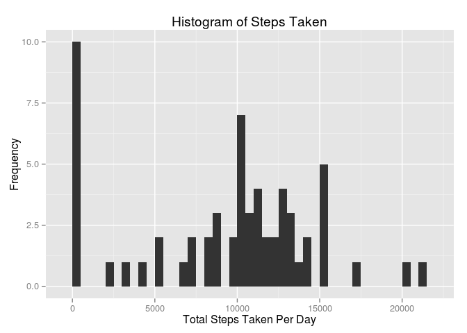
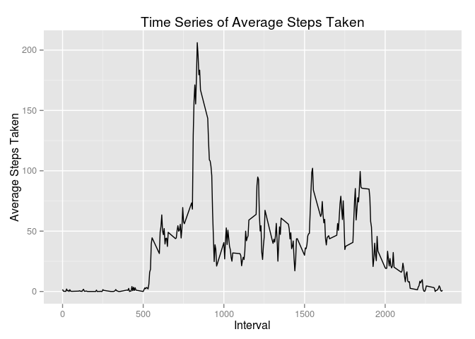
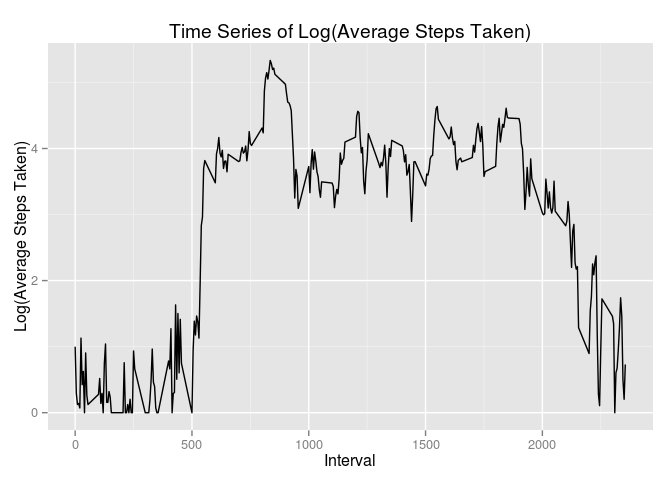
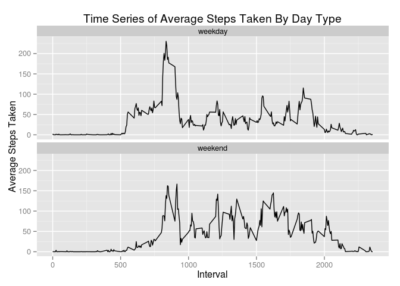

# Reproducible Research: Peer Assessment 1


## Loading and preprocessing the data
#### Load libraries

```r
library(dplyr)
library(ggplot2)
```
#### Load data

```r
if ( !file.exists("activity.csv") ) 
{
    unzip("activity.zip")
}
steps.df <- read.csv("activity.csv")
```
#### Structure of data

```r
str(steps.df)
```

```
## 'data.frame':	17568 obs. of  3 variables:
##  $ steps   : int  NA NA NA NA NA NA NA NA NA NA ...
##  $ date    : Factor w/ 61 levels "2012-10-01","2012-10-02",..: 1 1 1 1 1 1 1 1 1 1 ...
##  $ interval: int  0 5 10 15 20 25 30 35 40 45 ...
```

```r
head(steps.df)
```

```
##   steps       date interval
## 1    NA 2012-10-01        0
## 2    NA 2012-10-01        5
## 3    NA 2012-10-01       10
## 4    NA 2012-10-01       15
## 5    NA 2012-10-01       20
## 6    NA 2012-10-01       25
```
#### Convert the date column from factor to POSIXct type

```r
steps.df$date <- as.POSIXct(strptime(steps.df$date, format="%Y-%m-%d"))
```
## What is mean total number of steps taken per day?
#### Find total steps taken, grouped by date

```r
steps.bydate <- summarise(group_by(steps.df, date), total = sum(steps, na.rm=T))
```
#### Plot histogram of total steps taken per day

```r
qplot(total, data=steps.bydate, binwidth=500) + 
  xlab("Total Steps Taken Per Day") + 
  ylab("Frequency") + 
  ggtitle("Histogram of Steps Taken")
```

 

#### Mean and median of total steps taken per day
Mean is 

```r
format(round(mean(steps.bydate$total), 2), scientific=4)
```

```
## [1] "9354.23"
```

and Median is 

```r
format(round(median(steps.bydate$total), 2), scientific=4)
```

```
## [1] "10395"
```

## What is the average daily activity pattern?
#### Find average steps taken by Interval across all days

```r
steps.byinterval <- summarise(group_by(steps.df, interval), Mean = mean(steps, na.rm=T))
```
#### Plot time series of Average Steps taken by Interval

```r
qplot(interval, Mean, data=steps.byinterval, geom="line") + 
  xlab("Interval") + 
  ylab("Average Steps Taken") + 
  ggtitle("Time Series of Average Steps Taken")
```

 

#### Plot time series of Log(Average Steps taken) by Interval, to amplify small variations and dampen larger ones.

```r
qplot(interval, log(Mean + 1), data=steps.byinterval, geom="line") + 
  xlab("Interval") + 
  ylab("Log(Average Steps Taken)") + 
  ggtitle("Time Series of Log(Average Steps Taken)")
```

 

#### Find interval containing maximum number of average steps
The interval containing the maximum number of average steps 

```r
format(round(max(steps.byinterval$Mean), 2), scientific=4) 
```

```
## [1] "206.17"
```
is 

```r
steps.byinterval[steps.byinterval$Mean == max(steps.byinterval$Mean), ]$interval
```

```
## [1] 835
```


## Imputing missing values
#### Missing values in the data
Number of rows

```r
nrow(steps.df)
```

```
## [1] 17568
```
Number of rows with missing Steps 

```r
sum(is.na(steps.df$steps))
```

```
## [1] 2304
```
Number of rows with missing Interval

```r
sum(is.na(steps.df$interval))
```

```
## [1] 0
```
Number of rows with missing Date

```r
sum(is.na(steps.df$date))
```

```
## [1] 0
```

#### Impute missing Steps values by replacing it with the average number of steps for that specific interval

```r
steps.imputed <- mapply(function(st, itv)  { ifelse(is.na(st), 
                                                      subset(steps.byinterval, 
                                                             interval==itv, 
                                                             select=c("Mean"))$Mean, 
                                                      st)},
                           steps.df$steps, 
                           steps.df$interval)
```
#### Create a new data set with the missing steps filled in

```r
steps.df.imputed <- data.frame(steps = steps.imputed, interval=steps.df$interval, date=steps.df$date)
```
#### Find total steps taken, grouped by date

```r
steps.imputed.bydate <- summarise(group_by(steps.df.imputed, date), total = sum(steps, na.rm=T))
```
#### Plot histogram of total steps taken per day

```r
qplot(total, data=steps.imputed.bydate, binwidth=500) + 
  xlab("Total Steps Taken Per Day") + 
  ylab("Frequency") + 
  ggtitle("Histogram of Steps Taken (after imputation)")
```

 

#### Find mean and median of total steps taken per day

```r
mean.after <- mean(steps.imputed.bydate$total)
mean.before <- mean(steps.bydate$total)
median.after <- median(steps.imputed.bydate$total)
median.before <- median(steps.bydate$total)
```

Measure | Value After Imputation | Value Before Imputation | Difference 
-----|--------|------
Mean | 10766.19 |9354.23|1411.96
Median| 10766.19|10395| 371.19 

Both mean and median have increased after imputation. Mean and median, after imputation, are equal implying that the distribution now is symmetric around the mean.

## Are there differences in activity patterns between weekdays and weekends?
#### Create a new factor variable 'daytype'

```r
steps.df.imputed$daytype <- 
  as.factor(ifelse(strftime(steps.df.imputed$date, format="%a") %in% c("Sat", "Sun"), 'weekend', 'weekday'))
```

#### Find the average steps taken per interval 

```r
steps.imputed.byinterval <- 
  summarise(group_by(steps.df.imputed, daytype, interval), Mean = mean(steps))
```

#### Plot time series for average number of steps taken for weekend and weekday

```r
qplot(interval, Mean, data=steps.imputed.byinterval, geom="line") +
     facet_wrap( ~daytype, ncol=1) +
     xlab("Interval") + 
     ylab("Average Steps Taken") + 
     ggtitle("Time Series of Average Steps Taken By Day Type")
```

 
