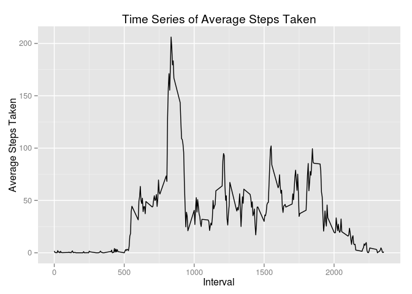
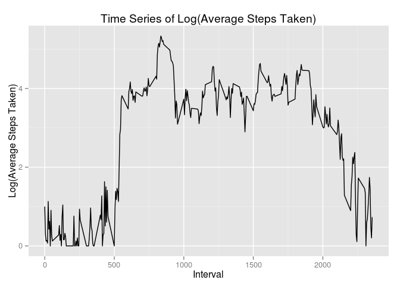
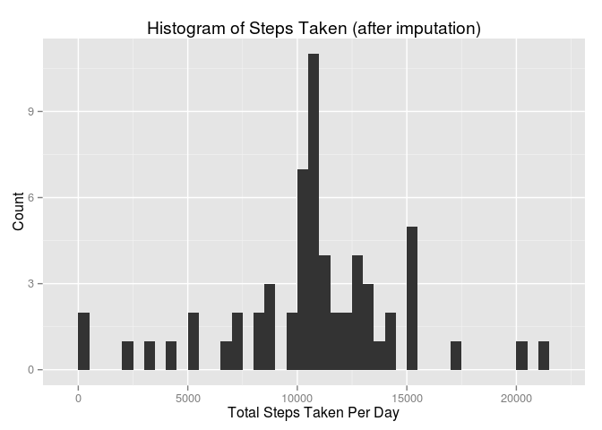

# Reproducible Research: Peer Assessment 1


## Loading and preprocessing the data
#### Load libraries

```r
library(dplyr)
library(ggplot2)
```
#### Load data

```r
steps.df <- read.csv("activity.csv")
```
#### Structure of data

```r
str(steps.df)
```

```
## 'data.frame':	17568 obs. of  3 variables:
##  $ steps   : int  NA NA NA NA NA NA NA NA NA NA ...
##  $ date    : Factor w/ 61 levels "2012-10-01","2012-10-02",..: 1 1 1 1 1 1 1 1 1 1 ...
##  $ interval: int  0 5 10 15 20 25 30 35 40 45 ...
```

```r
head(steps.df)
```

```
##   steps       date interval
## 1    NA 2012-10-01        0
## 2    NA 2012-10-01        5
## 3    NA 2012-10-01       10
## 4    NA 2012-10-01       15
## 5    NA 2012-10-01       20
## 6    NA 2012-10-01       25
```
#### Convert the date column from factor to POSIXlt type

```r
steps.df$date <- as.POSIXct(strptime(steps.df$date, format="%Y-%m-%d"))
```
## What is mean total number of steps taken per day?
#### Total steps taken, grouped by date

```r
steps.bydate <- summarise(group_by(steps.df, date), total = sum(steps, na.rm=T))
```
#### Histogram of total steps taken per day

```r
qplot(total, data=steps.bydate, binwidth=500) + 
  xlab("Total Steps Taken Per Day") + 
  ylab("Count") + 
  ggtitle("Histogram of Steps Taken")
```

 

#### Mean and median of total steps taken per day
Mean is 9354.23 and Median is 10395. 

## What is the average daily activity pattern?
#### Average steps taken by Interval across all days

```r
steps.byinterval <- summarise(group_by(steps.df, interval), Mean = mean(steps, na.rm=T))
```
#### Time series plot of Average Steps taken by Interval

```r
qplot(interval, Mean, data=steps.byinterval, geom="line") + 
  xlab("Interval") + 
  ylab("Average Steps Taken") + 
  ggtitle("Time Series of Average Steps Taken")
```

 

#### Time series plot of Log(Average Steps taken) by Interval

```r
qplot(interval, log(Mean + 1), data=steps.byinterval, geom="line") + 
  xlab("Interval") + 
  ylab("Log(Average Steps Taken)") + 
  ggtitle("Time Series of Log(Average Steps Taken)")
```

 

#### Interval containing maximum number of average steps
The interval containing the maximum number of average steps, ``206.1698113``,  is ``835``.

## Imputing missing values
#### Missing values in the data
* Total number of rows in the data is 17568. 
* Number of rows with missing Steps is 2304. 
* Number of rows with missing Interval is 0. 
* Number of rows with missing Date is 0.

#### Impute missing Steps values by replacing it with the average number of steps for that specific interval

```r
steps.imputed <- mapply(function(st, itv)  { ifelse(is.na(st), 
                                                      subset(steps.byinterval, 
                                                             interval==itv, 
                                                             select=c("Mean"))$Mean, 
                                                      st)},
                           steps.df$steps, 
                           steps.df$interval)
```
#### Create a new data set with the missing steps filled in

```r
steps.df.imputed <- data.frame(steps = steps.imputed, interval=steps.df$interval, date=steps.df$date)
```
#### Total steps taken, grouped by date

```r
steps.imputed.bydate <- summarise(group_by(steps.df.imputed, date), total = sum(steps, na.rm=T))
```
#### Histogram of total steps taken per day

```r
qplot(total, data=steps.imputed.bydate, binwidth=500) + 
  xlab("Total Steps Taken Per Day") + 
  ylab("Count") + 
  ggtitle("Histogram of Steps Taken (after imputation)")
```

 

#### Mean and median of total steps taken per day
Mean is 10766.19 and Median is 10766.19. 
After imputation, the mean increased by 1411.96 steps per day and the median increased by 371.19.
Since the median and mean are equal, the new distribution of steps by date seems to be symmetric around the mean.

## Are there differences in activity patterns between weekdays and weekends?
#### Create a new factor variable 'daytype'

```r
steps.df.imputed$daytype = as.factor(ifelse(strftime(steps.df.imputed$date, format="%a") %in% c("Sat", "Sun"), 'weekend', 'weekday'))
```

#### Find average steps taken per interval 

```r
steps.imputed.byinterval <- summarise(group_by(steps.df.imputed, daytype, interval), Mean = mean(steps))
```

#### Time series plot for average number of steps taken for weekend and weekdays

```r
qplot(interval, Mean, data=steps.imputed.byinterval, geom="line") +
     facet_wrap( ~daytype, ncol=1) +
     xlab("Interval") + 
     ylab("Average Steps Taken") + 
     ggtitle("Time Series of Average Steps Taken By Day Type")
```

 
